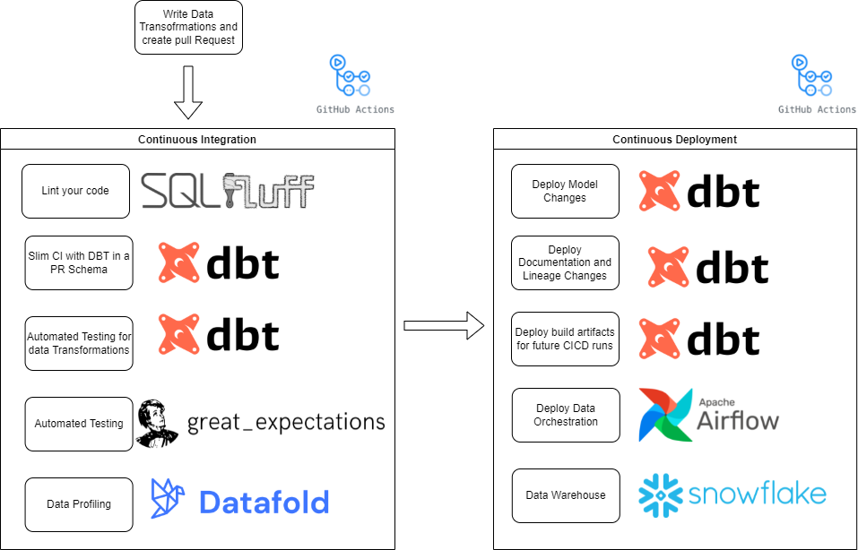

# snowflake and dbt (plus other goodies)

This is a playground for me to test and document my analytical engineering skills.


## architecture


## repos

This project is broken down into several repos to isolate environments and to simplify CICD.

- [dbt-wisemuffin-sf-trading](https://github.com/wisemuffin/dbt-wisemuffin-sf-trading) - demo dbt features
- [data-cicd-tpch](https://github.com/wisemuffin/data-cicd-tpch) - demo dbt with a CICD pipeline
- [terraform-snowflake-fast-data-warehouse](https://github.com/wisemuffin/terraform-snowflake-fast-data-warehouse) - manages all cloud infrastructure.
- [dbt-business-intelligence](https://github.com/wisemuffin/dbt-business-intelligence) - demos how to use dbt's metrics and metadata in bi tools. Credit all goes to [flexanalytics repo](https://github.com/flexanalytics/dbt-business-intelligence)
- [dbt-joining-snapshots](https://github.com/wisemuffin/dbt-joining-snapshots)

## features - snowflake

### query tagging

if you go in Snowflake UI and click ‘History' icon on top, you are going to see all SQL queries run on Snowflake account(successful, failed, running etc) and clearly see what dbt model this particular query is related to:


[source](https://quickstarts.snowflake.com/guide/data_engineering_with_dbt_cli/index.html?index=..%2F..index#6)

### resource monitor

Ideally this will be included in my terraform infrastructure as code. However currently due to the limitation of only accountadmin role only have the ability to create this resource i have set this up manually.s


### external functions (integration with AWS sagemaker)

[example](https://quickstarts.snowflake.com/guide/recommendation_engine_aws_sagemaker/index.html?index=..%2F..index#0)

external functions let you bind a function in snowflake to a compute layer outside of snowflake. I.e. in this example i am executing a function in SQL but behind the scenes its requesting some AWS lambda functions written in python to call AWS sagemaker's APIs.

I have setup 3 functions that will 
- train_and_get_recommendations - train sagemaker model with snowflake data
- deploy_model - deploy an endpoint so that your model can be used via an api
- invoke_model - we can then invoke the deployed model

```sql
-- You'll need to specify two parameters. First, MOVIELENS.PUBLIC.ratings_train_data is the input table containing the training data. Second, MOVIELENS.PUBLIC.user_movie_recommendations, is the output table where the top 10 predictions will be stored.

select train_and_get_recommendations('MOVIELENS.PUBLIC.ratings_train_data','MOVIELENS.PUBLIC.user_movie_recommendations');

select * from user_movie_recommendations limit 10;

select deploy_model('movielens-model-v1', 's3://sagemaker-snf-demo-wisemuffin/training-job-20211201005747/output/model.tar.gz');

-- create a table to hold pairs of users and movies where we DO NOT have a rating
create or replace table no_ratings (USERID float, MOVIEID float);

insert into no_ratings (USERID, MOVIEID) values
    ('1', '610'),
    ('10', '313'),
    ('10', '297'),
    ('5', '18'),
    ('5', '19');

--real-time prediction for an individual movie for a particular user
select nr.USERID, nr.MOVIEID, m.title, invoke_model('movielens-model-v1', nr.USERID, nr.MOVIEID) as rating_prediction 
from no_ratings nr, movies m
where nr.movieid = m.movieid;
```

### feature engineering

[Zero Copy Cloning](https://www.youtube.com/watch?v=yQIMmXg7Seg) that will create a new copy of the data by only making a copy of the metadata of the objects

## features - dbt

### custom schema naming

By default, dbt is [generating a schema name](https://docs.getdbt.com/docs/building-a-dbt-project/building-models/using-custom-schemas) by appending it to the target schema environment name(dev, prod). In dbt_trading I show you a quick way to override this macro, making our schema names to look exactly the same between dev and prod databases. 

### CICD

I have demoed a CICD pipeline on [youtube](https://www.youtube.com/watch?v=uotDffI33jg&t=1382s)

repo: [data-cicd-tpch](https://github.com/wisemuffin/data-cicd-tpch) - demo dbt with a CICD pipeline



### lineage in cloud
 TODO


## dbt projects

### bt-wisemuffin-sf-trading

repo: [dbt-wisemuffin-sf-trading](https://github.com/wisemuffin/dbt-wisemuffin-sf-trading)

This is build from snowflakes quick start [Accelerating Data Engineering with Snowflake & dbt CLI](https://quickstarts.snowflake.com/guide/data_engineering_with_dbt_cli/index.html?index=..%2F..index#1)

*dbt features demoed:*
- custom schema naming
- query tagging
- basic incremental model (append only) - models/l30_mart/fct_trading_pnl.sql as the source data is live this is easy to show.
- dbt_utils.union_relations - see models/l20_transform/tfm_book.sql which unions two manually uploaded (seeds) trading books.

*snowflake features demoed*
- uses live data market data shared on snowflake

*sources*
-  Knoema Dataset Catalog table: daily exchange rates  
-  Knoema Dataset Catalog table: daily US trading history


## infrastructure

All dbt projects infrastructure is being managed by a single [terraform repo](https://github.com/wisemuffin/terraform-snowflake-fast-data-warehouse).

## data integration

TODO

## orchistration

TODO

## data quality and goverance

TODO

## data visualisation

TODO